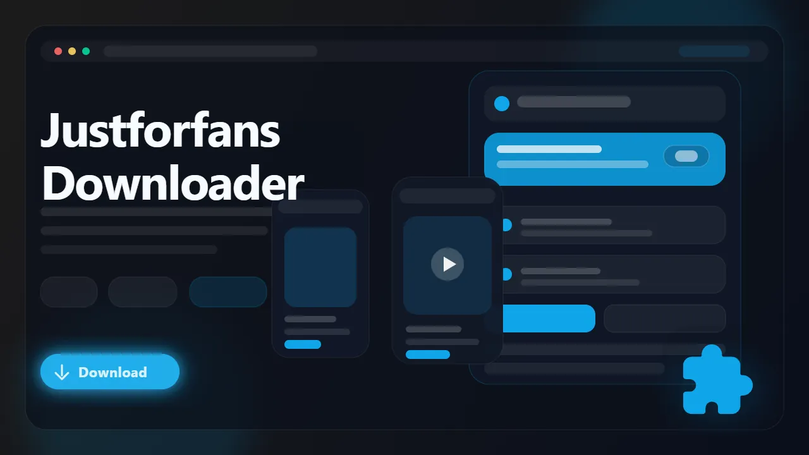

# JustForFans Downloader (Browser Extension)

> Save JustForFans videos, images, galleries, and text posts from creator feeds directly in your browser.

JustForFans Downloader is a browser extension built specifically for saving supported JustForFans content in a cleaner, browser-native workflow. It can detect videos, images, gallery posts, and text from visible feed items, organize them by content type, and export video as MP4 for easier offline viewing.

- Save JustForFans videos, images, galleries, and text posts
- Download all visible feed content in one pass with a bulk action
- Export supported video streams as MP4 files
- Keep downloads organized in a dedicated JustForFans folder
- Skip generic tools that miss protected or feed-scoped media

## Links

- :rocket: Get it here: [JustForFans Downloader](https://serp.ly/justforfans-downloader)
- :new: Latest release: [GitHub Releases](https://github.com/serpapps/justforfans-downloader/releases/latest)
- :question: Help center: [SERP Help](https://help.serp.co/en/)
- :beetle: Report bugs: [GitHub Issues](https://github.com/serpapps/justforfans-downloader/issues)
- :bulb: Request features: [Feature Requests](https://github.com/serpapps/justforfans-downloader/discussions)

## Preview

## Table of Contents

- [Why JustForFans Downloader](#why-justforfans-downloader)
- [Features](#features)
- [How It Works](#how-it-works)
- [Step-by-Step Tutorial: How to Download Content from JustForFans](#step-by-step-tutorial-how-to-download-content-from-justforfans)
- [Supported Formats](#supported-formats)
- [Who It's For](#who-its-for)
- [Common Use Cases](#common-use-cases)
- [Troubleshooting](#troubleshooting)
- [Trial and Access](#trial-and-access)
- [Installation Instructions](#installation-instructions)
- [FAQ](#faq)
- [License](#license)
- [Notes](#notes)
- [About JustForFans](#about-justforfans)

## Why JustForFans Downloader

JustForFans content is not limited to one simple file type. Videos can rely on protected playback, galleries require expansion, and text posts live alongside media in the same feed. Generic downloaders usually ignore half that structure. They miss gallery images, skip feed text, or fail once the video is delivered through a protected player.

JustForFans Downloader is built for the actual feed workflow. It scans visible posts, groups content by type, and gives you direct save options for videos, images, galleries, and text from the same page.

## Features

- Feed-aware scanning for videos, images, galleries, and text
- Per-post download controls for targeted saves
- Bulk "Download Visible" action for on-screen feed content
- Converts HLS streams and DASH encrypted video to MP4 in-browser
- MP4 export for supported video playback flows
- Gallery expansion support for multi-image posts
- Quality selector with all available video resolutions
- Right-click context menu for quick video downloads
- Download organization into a JustForFans folder
- Tabbed popup UI for browsing Videos, Images, and Text Posts separately
- Cross-browser support for Chrome, Edge, Brave, Opera, Firefox, Whale, and Yandex

## How It Works

1. Install the extension from the latest release.
2. Sign in with your email and verify using a one-time code.
3. Open a JustForFans creator page and scroll through the feed.
4. Let the extension scan visible posts.
5. Open the popup to review Videos, Images, and Text tabs.
6. Save individual posts or use the bulk action to download everything currently visible.
7. Check your Downloads/JustForFans folder for saved content.

## Step-by-Step Tutorial: How to Download Content from JustForFans

1. Install JustForFans Downloader in your browser.
2. Open the extension and complete email sign-in with the one-time verification code.
3. Go to a creator page on JustForFans and scroll through the content you want to save.
4. Open the popup to review Videos, Images, and Text tabs.
5. Use the per-post download button for individual items or "Download Visible" to bulk save everything currently on screen.
6. For videos, choose the available quality if more than one option appears.
7. After scrolling to load more content, click the Rescan button to detect new posts.
8. Open the saved content from your Downloads/JustForFans folder.

## Supported Formats

- Video output: MP4
- Image output: original downloadable image files where supported
- Text output: saved text post content

Video files use MP4 so they are easier to replay on standard media players, move between devices, or archive locally. HLS and DASH streams are converted automatically.

## Who It's For

- JustForFans subscribers who want offline access to content they can already view
- Users archiving creator posts, galleries, and videos in one workflow
- Non-technical users who want a browser extension instead of scripts
- People who need feed-aware bulk download controls
- Anyone organizing personal downloads into a cleaner local library

## Common Use Cases

- Save a creator feed for offline access
- Download visible videos, images, and text in one pass
- Export supported JustForFans videos as MP4
- Archive gallery posts without opening every item manually
- Use per-post buttons for targeted saves of individual items

## Troubleshooting

**The extension is not finding posts**  
Scroll through the feed first so the content becomes visible, then rescan.

**The video download is not listed**  
Open the post and start playback so the player exposes the active media stream.

**New posts are missing after I scrolled**
Use the rescan action after more content loads into the page.

**The download failed partway through**
Check your connection and refresh the page before starting again.

**A video uses DRM or encryption**
The extension includes DASH decryption support for encrypted streams commonly used on JustForFans.

## Trial and Access

- Includes **3 free downloads** so you can test the workflow first
- Email sign-in uses secure one-time password verification
- No credit card required for the trial
- Unlimited downloads are available with a paid license

Start here: [https://serp.ly/justforfans-downloader](https://serp.ly/justforfans-downloader)

## Installation Instructions

1. Open the latest release page: [GitHub Releases](https://github.com/serpapps/justforfans-downloader/releases/latest)
2. Download the correct build for your browser.
3. Install the extension.
4. Sign in with your email and verify the one-time code.
5. Open a JustForFans creator page and start downloading supported content.

## FAQ

**Can it download more than just videos?**  
Yes. It can also save supported images, gallery posts, and text posts.

**Can I bulk-download visible feed items?**  
Yes. Use the "Download Visible" workflow for everything currently on screen.

**Does it work without extra software?**
Yes. The full workflow runs inside the browser extension.

**Can I download gallery or carousel posts?**
Yes. The extension automatically expands gallery and carousel posts to capture all images in multi-image posts.

**Where are my downloads saved?**
Content automatically saves to a JustForFans subfolder inside your browser's default Downloads directory.

**Is my data safe?**
Yes. All processing happens entirely in your browser. Authentication uses secure OTP with no passwords stored.

## License

This repository is distributed under the proprietary SERP Apps license in the [LICENSE](LICENSE) file. Review that file before copying, modifying, or redistributing any part of this project.

## Notes

- Only download content you own or have explicit permission to save
- An internet connection is required for downloads
- Content must be visible on the page before it can be detected — scroll to load
- A valid JustForFans subscription is required to access creator content

## About JustForFans

JustForFans is a creator platform where videos, images, galleries, and text posts all live together in the feed. JustForFans Downloader is built to handle that mixed-content workflow more accurately than generic media download tools.
